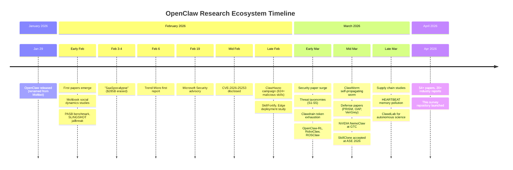

# Awesome OpenClaw Research [](https://awesome.re)

<p align="center">
  
</p>

<p align="center">
  <b>A curated collection of academic papers, security reports, datasets, and tools for the OpenClaw AI agent ecosystem.</b>
  <br/>
  <i>Companion resource for our survey paper.</i>
</p>

<p align="center">
  
  
  
  
  
</p>

OpenClaw — the open-source, self-hosted AI agent platform created by Peter Steinberger (evolving from Clawdbot → Moltbot → OpenClaw on January 29, 2026) — has generated **54+ academic papers** and **20+ major industry reports** in under three months. This repository organizes the research landscape using a three-layer **PTA (Platform–Trust & Safety–Application)** taxonomy.

---

## Statistics at a Glance

| Layer | Category | Papers | Sub-topics |
|:-----:|:---------|:------:|:-----------|
| 🔧 **P** | Platform & Ecosystem | 9 | Core architecture, RL training, skill supply chain |
| 🛡️ **T** | Trust & Safety | 16 | Threat taxonomies, adversarial attacks, defenses |
| 🌐 **A** | Application & Society | 29 | Robotics, healthcare, Moltbook dynamics, surveys |
| | **Total** | **54** | |

### Research Timeline



---

## Contents

### :page_facing_up: Research Papers
- [🔧 Platform & Ecosystem](#-platform--ecosystem)
  - [Core Architecture](#core-architecture-3)
  - [Skill Ecosystem & Supply Chain](#skill-ecosystem--supply-chain-6)
- [🛡️ Trust & Safety](#%EF%B8%8F-trust--safety)
  - [Threat Analysis & Taxonomies](#threat-analysis--taxonomies-8)
  - [Adversarial Attacks](#adversarial-attacks-4)
  - [Defensive Architectures](#defensive-architectures-4)
- [🌐 Application & Society](#-application--society)
  - [Domain Applications](#domain-applications-7)
  - [Moltbook Social Dynamics](#moltbook-social-dynamics-18)
  - [Ecosystem Perspectives](#ecosystem-perspectives-4)

### :file_folder: Resources
- [:shield: Industry Security Reports](#shield-industry-security-reports)
- [:wrench: Open-Source Projects & Tools](#wrench-open-source-projects--tools)
- [:bar_chart: Datasets & Benchmarks](#bar_chart-datasets--benchmarks)
- [:link: Related Awesome Lists](#link-related-awesome-lists)
- [:handshake: Contributing](#handshake-contributing)

---

## 🔧 Platform & Ecosystem

*How OpenClaw is built — core architecture extensions and skill supply chain. (9 papers)*

### ⚙️ Core Architecture (3)

<table>
<colgroup>
<col style="width: 40%">
<col style="width: 10%">
<col style="width: 38%">
<col style="width: 12%">
</colgroup>
<thead>
<tr><th align="left">Title</th><th align="center">Date</th><th align="left">Key Contribution</th><th align="center">Links</th></tr>
</thead>
<tbody>
<tr><td>OpenClaw-RL: Train Any Agent Simply by Talking</td><td align="center">Mar 2026</td><td>Async RL from live interaction signals; combines evaluative and directive rewards</td><td align="center"><a href="https://arxiv.org/abs/2603.10165">Paper</a> <a href="https://github.com/Gen-Verse/OpenClaw-RL">Code</a></td></tr>
<tr><td>OpenCLAW-P2P: A Decentralized Framework for Collective AI Intelligence</td><td align="center">Mar 2026</td><td>Decentralized agent network with DHT, federated learning, and formal verification</td><td align="center"><a href="https://www.researchgate.net/publication/401449080">Paper</a></td></tr>
<tr><td>Systems-Level Attack Surface of Edge Agent Deployments on IoT</td><td align="center">Feb 2026</td><td>Deployment architecture is the primary security determinant for edge agents</td><td align="center"><a href="https://arxiv.org/abs/2602.22525">Paper</a></td></tr>
</tbody>
</table>

### 📦 Skill Ecosystem & Supply Chain (6)

<table>
<colgroup>
<col style="width: 40%">
<col style="width: 10%">
<col style="width: 38%">
<col style="width: 12%">
</colgroup>
<thead>
<tr><th align="left">Title</th><th align="center">Date</th><th align="left">Key Contribution</th><th align="center">Links</th></tr>
</thead>
<tbody>
<tr><td>SkillFortify: Formal Analysis and Supply Chain Security</td><td align="center">Feb 2026</td><td>First formal supply-chain framework with Dolev-Yao attacker model for skills</td><td align="center"><a href="https://arxiv.org/abs/2603.00195">Paper</a> <a href="https://github.com/varun369/skillfortify">Code</a></td></tr>
<tr><td>SkillProbe: Security Auditing via Multi-Agent Collaboration</td><td align="center">Mar 2026</td><td>Multi-agent auditing reveals most popular skills fail rigorous security checks</td><td align="center"><a href="https://arxiv.org/abs/2603.21019">Paper</a></td></tr>
<tr><td>SkillClone: Multi-Modal Clone Detection ⭐ <b>ASE 2026</b></td><td align="center">Mar 2026</td><td>First multi-modal clone detector; massive ecosystem inflation from cloning</td><td align="center"><a href="https://arxiv.org/abs/2603.22447">Paper</a></td></tr>
<tr><td>Malicious Or Not: Repository Context for Skill Classification</td><td align="center">Mar 2026</td><td>Largest skill ecosystem study; repo-context dramatically reduces false positives</td><td align="center"><a href="https://arxiv.org/abs/2603.16572">Paper</a></td></tr>
<tr><td>SkillNet: Create, Evaluate, and Connect AI Skills</td><td align="center">Feb 2026</td><td>Unified skill ontology with multi-dimensional quality evaluation framework</td><td align="center"><a href="https://arxiv.org/abs/2603.04448">Paper</a> <a href="https://github.com/zjunlp/SkillNet">Code</a></td></tr>
<tr><td>SkillReducer: Optimizing LLM Agent Skills for Token Efficiency</td><td align="center">Mar 2026</td><td>Skill debloating framework compresses descriptions while preserving functionality</td><td align="center"><a href="https://arxiv.org/abs/2603.29919">Paper</a></td></tr>
</tbody>
</table>

<p align="right"><a href="#contents">Back to Top</a></p>

---

## 🛡️ Trust & Safety

*Security challenges after deployment — threats, attacks, and defenses. (16 papers + industry reports)*

### 🔍 Threat Analysis & Taxonomies (8)

| Title&nbsp;&nbsp;&nbsp;&nbsp;&nbsp;&nbsp;&nbsp;&nbsp;&nbsp;&nbsp;&nbsp;&nbsp;&nbsp;&nbsp;&nbsp;&nbsp;&nbsp;&nbsp;&nbsp;&nbsp;&nbsp;&nbsp;&nbsp;&nbsp;&nbsp;&nbsp;&nbsp;&nbsp;&nbsp;&nbsp;&nbsp;&nbsp;&nbsp;&nbsp;&nbsp; | Date | Key Contribution&nbsp;&nbsp;&nbsp;&nbsp;&nbsp;&nbsp;&nbsp;&nbsp;&nbsp;&nbsp;&nbsp;&nbsp;&nbsp;&nbsp;&nbsp;&nbsp;&nbsp;&nbsp;&nbsp;&nbsp;&nbsp;&nbsp;&nbsp;&nbsp;&nbsp;&nbsp; | Links |
|:------|:----:|:-----------------|:-----:|
| Uncovering Security Threats in Autonomous Agents (FASA) | Mar 2026 | Tri-layered risk taxonomy with full-lifecycle defense architecture | [Paper](https://arxiv.org/abs/2603.12644) [Code](https://github.com/NY1024/ClawGuard) |
| Don't Let the Claw Grip Your Hand | Mar 2026 | Empirical red-teaming across six LLMs; human-in-the-loop defense layer | [Paper](https://arxiv.org/abs/2603.10387) [Code](https://github.com/S2yyyy/OpenClaw-Analysis) |
| Taming OpenClaw: Security Analysis and Mitigation | Mar 2026 | Five-stage lifecycle threat model; point defenses fail cross-stage attacks | [Paper](https://arxiv.org/abs/2603.11619) |
| A Systematic Taxonomy of Security Vulnerabilities | Mar 2026 | Analysis of 190 security advisories; OpenClaw-specific kill chain | [Paper](https://arxiv.org/abs/2603.27517) |
| Defensible Design for OpenClaw | Mar 2026 | Position paper with four risk classes and engineering research agenda | [Paper](https://arxiv.org/abs/2603.13151) |
| A Trajectory-Based Safety Audit of Clawdbot | Feb 2026 | Trajectory-level safety evaluation; complete failure on intent misunderstanding | [Paper](https://arxiv.org/abs/2602.14364) [Code](https://github.com/tychenn/clawdbot_report) |
| From Assistant to Double Agent (PASB) | Feb 2026 | First end-to-end benchmark for personalized agent security | [Paper](https://arxiv.org/abs/2602.08412) [Code](https://github.com/AstorYH/PASB) |
| ClawTrap: MITM-Based Red-Teaming Framework | Mar 2026 | First network-layer red-teaming framework for agent systems | [Paper](https://arxiv.org/abs/2603.18762) |

### 🔥 Adversarial Attacks (4)

| Title&nbsp;&nbsp;&nbsp;&nbsp;&nbsp;&nbsp;&nbsp;&nbsp;&nbsp;&nbsp;&nbsp;&nbsp;&nbsp;&nbsp;&nbsp;&nbsp;&nbsp;&nbsp;&nbsp;&nbsp;&nbsp;&nbsp;&nbsp;&nbsp;&nbsp;&nbsp;&nbsp;&nbsp;&nbsp;&nbsp;&nbsp;&nbsp;&nbsp;&nbsp;&nbsp; | Date | Key Contribution&nbsp;&nbsp;&nbsp;&nbsp;&nbsp;&nbsp;&nbsp;&nbsp;&nbsp;&nbsp;&nbsp;&nbsp;&nbsp;&nbsp;&nbsp;&nbsp;&nbsp;&nbsp;&nbsp;&nbsp;&nbsp;&nbsp;&nbsp;&nbsp;&nbsp;&nbsp; | Links |
|:------|:----:|:-----------------|:-----:|
| Clawdrain: Token Exhaustion via Tool-Calling Chains | Mar 2026 | Trojanized skill causes massive token amplification; denial-of-wallet attack | [Paper](https://arxiv.org/abs/2603.00902) |
| ClawWorm: Self-Propagating Attacks Across Agent Ecosystems | Mar 2026 | First self-replicating worm for a production agent framework | [Paper](https://arxiv.org/abs/2603.15727) |
| David vs. Goliath: Agent-to-Agent Jailbreaking (SLINGSHOT) | Feb 2026 | RL-trained jailbreak transfers zero-shot to closed-source models | [Paper](https://arxiv.org/abs/2602.02395) |
| HEARTBEAT: Silent Memory Pollution via Background Execution | Mar 2026 | Exploits heartbeat cycle as covert channel for persistent backdoor injection | [Paper](https://arxiv.org/abs/2603.23064) |

### 🛡️ Defensive Architectures (4)

| Title&nbsp;&nbsp;&nbsp;&nbsp;&nbsp;&nbsp;&nbsp;&nbsp;&nbsp;&nbsp;&nbsp;&nbsp;&nbsp;&nbsp;&nbsp;&nbsp;&nbsp;&nbsp;&nbsp;&nbsp;&nbsp;&nbsp;&nbsp;&nbsp;&nbsp;&nbsp;&nbsp;&nbsp;&nbsp;&nbsp;&nbsp;&nbsp;&nbsp;&nbsp;&nbsp; | Date | Key Contribution&nbsp;&nbsp;&nbsp;&nbsp;&nbsp;&nbsp;&nbsp;&nbsp;&nbsp;&nbsp;&nbsp;&nbsp;&nbsp;&nbsp;&nbsp;&nbsp;&nbsp;&nbsp;&nbsp;&nbsp;&nbsp;&nbsp;&nbsp;&nbsp;&nbsp;&nbsp; | Links |
|:------|:----:|:-----------------|:-----:|
| OpenClaw PRISM: Zero-Fork Runtime Security Layer | Mar 2026 | Defense-in-depth across 10 lifecycle hooks with risk accumulation and decay | [Paper](https://arxiv.org/abs/2603.11853) |
| Agent Privilege Separation Against Prompt Injection | Mar 2026 | Two-agent architecture eliminates prompt injection for constrained tasks | [Paper](https://arxiv.org/abs/2603.13424) |
| Before the Tool Call: Pre-Action Authorization (OAP) | Mar 2026 | Deterministic pre-action authorization blocks all unauthorized actions | [Paper](https://arxiv.org/abs/2603.20953) [Code](https://github.com/aporthq/aport-spec) |
| VeriGrey: Greybox Agent Validation | Mar 2026 | Grey-box fuzzing with tool-invocation coverage feedback outperforms black-box | [Paper](https://arxiv.org/abs/2603.17639) [Code](https://github.com/soarskylar/verigrey) |

<p align="right"><a href="#contents">Back to Top</a></p>

---

## 🌐 Application & Society

*Where OpenClaw is used and what emerges — domain applications, agent social dynamics, and ecosystem perspectives. (29 papers)*

### 🚀 Domain Applications (7)

| Title&nbsp;&nbsp;&nbsp;&nbsp;&nbsp;&nbsp;&nbsp;&nbsp;&nbsp;&nbsp;&nbsp;&nbsp;&nbsp;&nbsp;&nbsp;&nbsp;&nbsp;&nbsp;&nbsp;&nbsp;&nbsp;&nbsp;&nbsp;&nbsp;&nbsp;&nbsp;&nbsp;&nbsp;&nbsp;&nbsp;&nbsp;&nbsp;&nbsp;&nbsp;&nbsp; | Date | Key Contribution&nbsp;&nbsp;&nbsp;&nbsp;&nbsp;&nbsp;&nbsp;&nbsp;&nbsp;&nbsp;&nbsp;&nbsp;&nbsp;&nbsp;&nbsp;&nbsp;&nbsp;&nbsp;&nbsp;&nbsp;&nbsp;&nbsp;&nbsp;&nbsp;&nbsp;&nbsp; | Links |
|:------|:----:|:-----------------|:-----:|
| ROSClaw: OpenClaw ROS 2 Framework for Robot Control | Mar 2026 | Model-agnostic ROS 2 executive layer for multi-platform robot control | [Paper](https://arxiv.org/abs/2603.26997) |
| RoboClaw: Scalable Long-Horizon Robotic Tasks | Mar 2026 | VLM-driven controller with self-resetting data collection loops | [Paper](https://arxiv.org/abs/2603.11558) [Code](https://github.com/RoboClaw-Robotics/RoboClaw) |
| When OpenClaw Meets Hospital | Mar 2026 | Hospital-adapted architecture with HIPAA compliance and manifest-guided memory | [Paper](https://arxiv.org/abs/2603.11721) |
| Survivability-Aware Agentic Crypto Trading | Mar 2026 | Non-bypassable execution middleware for financial agent safety | [Paper](https://arxiv.org/abs/2603.10092) |
| IronEngine: Towards General AI Assistant | Mar 2026 | Systematic comparison across five agent platforms; identifies shared weaknesses | [Paper](https://arxiv.org/abs/2603.08425) |
| Human-AI Partnership in Education ⭐ **AIED 2026** | Mar 2026 | Emergent peer learning and trust dynamics across agent communities | [Paper](https://arxiv.org/abs/2603.16663) |
| From Agent-Only Networks to Autonomous Science (ClawdLab) | Feb 2026 | Autonomous scientific research platform with PI-led governance | [Paper](https://arxiv.org/abs/2602.19810) [Code](https://github.com/bio-xyz/ClawdLab) |

### Moltbook Social Dynamics (18)

*The first agent-only social network with 1.5M+ registered AI agents.*

#### 📊 Platform Measurement & Network Structure

| Title&nbsp;&nbsp;&nbsp;&nbsp;&nbsp;&nbsp;&nbsp;&nbsp;&nbsp;&nbsp;&nbsp;&nbsp;&nbsp;&nbsp;&nbsp;&nbsp;&nbsp;&nbsp;&nbsp;&nbsp;&nbsp;&nbsp;&nbsp;&nbsp;&nbsp;&nbsp;&nbsp;&nbsp;&nbsp;&nbsp;&nbsp;&nbsp;&nbsp;&nbsp;&nbsp; | Date | Key Contribution&nbsp;&nbsp;&nbsp;&nbsp;&nbsp;&nbsp;&nbsp;&nbsp;&nbsp;&nbsp;&nbsp;&nbsp;&nbsp;&nbsp;&nbsp;&nbsp;&nbsp;&nbsp;&nbsp;&nbsp;&nbsp;&nbsp;&nbsp;&nbsp;&nbsp;&nbsp; | Links |
|:------|:----:|:-----------------|:-----:|
| Collective Behavior of AI Agents: the Case of Moltbook | Feb 2026 | Large-scale statistical analysis showing human-like attention dynamics | [Paper](https://arxiv.org/abs/2602.09270) |
| Exploring Silicon-Based Societies | Feb 2026 | "Data-driven silicon sociology" framework; emergent community archetypes | [Paper](https://arxiv.org/abs/2602.02613) |
| 'Humans welcome to observe': A First Look at Moltbook | Feb 2026 | First measurement study with topic taxonomy and toxicity analysis | [Paper](https://arxiv.org/abs/2602.10127) |
| The Anatomy of the Moltbook Social Graph | Feb 2026 | Small-world structure but shallow, non-reciprocal micro-interactions | [Paper](https://arxiv.org/abs/2602.10131) [Code](https://github.com/daveholtz/moltbook_scraper) |
| The Rise of AI Agent Communities | Feb 2026 | Discourse analysis showing functional utility drives agent influence | [Paper](https://arxiv.org/abs/2602.12634) |
| Emergence of Fragility in LLM-based Social Networks | Mar 2026 | Core-periphery structure reveals vulnerability to targeted hub attacks | [Paper](https://arxiv.org/abs/2603.23279) |
| MoltNet: Understanding Social Behavior of AI Agents | Feb 2026 | Agents selectively mimic human behavior; persona drift after social rewards | [Paper](https://arxiv.org/abs/2602.13458) [Code](https://github.com/iNLP-Lab/MoltNet) |
| Social Simulacra in the Wild: AI vs Human Communities | Mar 2026 | First AI-vs-human community comparison; structural homogenization found | [Paper](https://arxiv.org/abs/2603.16128) |
| Scientific Discussions on Moltbook (BERTopic) | Mar 2026 | Topic modeling of AI science discourse; self-referential discussion patterns | [Paper](https://arxiv.org/abs/2603.11375) |

#### ⚠️ Safety, Norms & Emergent Behavior

| Title&nbsp;&nbsp;&nbsp;&nbsp;&nbsp;&nbsp;&nbsp;&nbsp;&nbsp;&nbsp;&nbsp;&nbsp;&nbsp;&nbsp;&nbsp;&nbsp;&nbsp;&nbsp;&nbsp;&nbsp;&nbsp;&nbsp;&nbsp;&nbsp;&nbsp;&nbsp;&nbsp;&nbsp;&nbsp;&nbsp;&nbsp;&nbsp;&nbsp;&nbsp;&nbsp; | Date | Key Contribution&nbsp;&nbsp;&nbsp;&nbsp;&nbsp;&nbsp;&nbsp;&nbsp;&nbsp;&nbsp;&nbsp;&nbsp;&nbsp;&nbsp;&nbsp;&nbsp;&nbsp;&nbsp;&nbsp;&nbsp;&nbsp;&nbsp;&nbsp;&nbsp;&nbsp;&nbsp; | Links |
|:------|:----:|:-----------------|:-----:|
| The Moltbook Illusion: Human vs Emergent Behavior | Feb 2026 | Temporal fingerprinting separates autonomous from human-influenced agents | [Paper](https://arxiv.org/abs/2602.07432) [Code](https://github.com/ln9527/moltbook-research) |
| The Devil Behind Moltbook: Safety Vanishing | Feb 2026 | Proves self-evolution trilemma impossibility result for agent societies | [Paper](https://arxiv.org/abs/2602.09877) |
| Agents in the Wild: Safety and Sociality on Moltbook | Feb 2026 | Governance and religion emerge spontaneously but interaction is performative | [Paper](https://arxiv.org/abs/2602.13284) |
| Risky Instruction Sharing and Norm Enforcement (AIRS) | Feb 2026 | Action-inducing posts trigger emergent decentralized norm enforcement | [Paper](https://arxiv.org/abs/2602.02625) [Code](https://github.com/kelkalot/moltbook-observatory) |
| Large-Scale Analysis of Political Propaganda on Moltbook | Mar 2026 | Political propaganda disproportionately concentrated in small post fraction | [Paper](https://arxiv.org/abs/2603.18349) |

#### 🔗 Learning & Coordination

| Title&nbsp;&nbsp;&nbsp;&nbsp;&nbsp;&nbsp;&nbsp;&nbsp;&nbsp;&nbsp;&nbsp;&nbsp;&nbsp;&nbsp;&nbsp;&nbsp;&nbsp;&nbsp;&nbsp;&nbsp;&nbsp;&nbsp;&nbsp;&nbsp;&nbsp;&nbsp;&nbsp;&nbsp;&nbsp;&nbsp;&nbsp;&nbsp;&nbsp;&nbsp;&nbsp; | Date | Key Contribution&nbsp;&nbsp;&nbsp;&nbsp;&nbsp;&nbsp;&nbsp;&nbsp;&nbsp;&nbsp;&nbsp;&nbsp;&nbsp;&nbsp;&nbsp;&nbsp;&nbsp;&nbsp;&nbsp;&nbsp;&nbsp;&nbsp;&nbsp;&nbsp;&nbsp;&nbsp; | Links |
|:------|:----:|:-----------------|:-----:|
| Peer Learning Patterns in the Moltbook Community | Feb 2026 | Taxonomy of peer response patterns: validation, extension, application | [Paper](https://arxiv.org/abs/2602.14477) |
| Informal Learners at Moltbook: Emergent Learning at Scale | Feb 2026 | Extreme broadcasting inversion; parallel monologues dominate interaction | [Paper](https://arxiv.org/abs/2602.18832) |
| MoltGraph: Temporal Graph for Coordinated-Agent Detection | Feb 2026 | First temporal graph dataset; coordinated posts get massive early engagement | [Paper](https://arxiv.org/abs/2603.00646) [Code](https://github.com/kunmukh/moltgraph) |
| Molt Dynamics: Emergent Social Phenomena | Mar 2026 | Role specialization emerges but multi-agent cooperation largely fails | [Paper](https://arxiv.org/abs/2603.03555) |

### 🔭 Ecosystem Perspectives (4)

| Title&nbsp;&nbsp;&nbsp;&nbsp;&nbsp;&nbsp;&nbsp;&nbsp;&nbsp;&nbsp;&nbsp;&nbsp;&nbsp;&nbsp;&nbsp;&nbsp;&nbsp;&nbsp;&nbsp;&nbsp;&nbsp;&nbsp;&nbsp;&nbsp;&nbsp;&nbsp;&nbsp;&nbsp;&nbsp;&nbsp;&nbsp;&nbsp;&nbsp;&nbsp;&nbsp; | Date | Key Contribution&nbsp;&nbsp;&nbsp;&nbsp;&nbsp;&nbsp;&nbsp;&nbsp;&nbsp;&nbsp;&nbsp;&nbsp;&nbsp;&nbsp;&nbsp;&nbsp;&nbsp;&nbsp;&nbsp;&nbsp;&nbsp;&nbsp;&nbsp;&nbsp;&nbsp;&nbsp; | Links |
|:------|:----:|:-----------------|:-----:|
| OpenClaw as Language Infrastructure: A Case-Centered Survey | Mar 2026 | GATE and AERO analytical frameworks; 38 papers surveyed | [Paper](https://doi.org/10.20944/preprints202603.1060.v1) |
| A Survey on the Unique Security of LLM Agents | Mar 2026 | Manus (closed) vs OpenClaw (open) as two dominant paradigms | [Paper](https://www.preprints.org) |
| Clippy to MS Office : OpenClaw to the Entire System | Mar 2026 | Privacy Visual Wrapper; Agentic Trust Calibration Model | [Paper](https://www.researchgate.net/publication/402018930) |
| The Innovator's Dilemma in the Age of Autonomous Agents | Feb 2026 | "SaaSpocalypse" ($285B erased); "pincer disruption" concept | [Paper](https://www.researchgate.net/publication/400542271) |

<p align="right"><a href="#contents">Back to Top</a></p>

---

## :shield: Industry Security Reports

| Organization | Report | Date | Key Finding |
|:-------------|:-------|:----:|:------------|
| **Trend Micro** | Viral AI, Invisible Risks | Feb 2026 | TrendAI Digital Assistant Framework mapping |
| **Trend Micro** | Malicious Skills Distribute AMOS Stealer | Feb 2026 | AMOS stealer via SKILL.md across 39 skills |
| **Trend Micro** | CISOs in a Pinch | Feb 2026 | "Lethal Trifecta + Persistence" concept |
| **Trend Micro** | TrendAI Secures the OpenClaw Era | Mar 2026 | Agentic Governance Gateway announcement |
| **Microsoft** | Running OpenClaw Safely | Feb 2026 | "Not appropriate for standard workstations" |
| **NVIDIA** | NemoClaw at GTC 2026 | Mar 2026 | Open-source security wrapper with OpenShell |
| **Oasis Security** | ClawJacked | Feb 2026 | WebSocket takeover; patched in 24h |
| **Koi / Repello AI** | ClawHavoc Campaign | Feb 2026 | 824+ malicious skills via CVE-2026-25253 |
| **Kaspersky** | OpenClaw Unsafe for Use | Feb 2026 | 512 vulns (8 critical); ~1K exposed instances |
| **Cisco AI** | OpenClaw Skill Audit | Feb 2026 | 26% of 31K skills vulnerable |
| **Sophos** | Security Analysis | 2026 | Exposed instances; sandbox escape |
| **Snyk Labs** | Dependency Analysis | 2026 | Supply chain risk in skill dependencies |
| **JFrog** | Package Security | 2026 | Malicious package detection |
| **SecurityScorecard** | Risk Assessment | 2026 | Enterprise deployment risk guidance |
| **Hunt.io** | Exposure Report | 2026 | 30K-135K+ exposed instances |

<p align="right"><a href="#contents">Back to Top</a></p>

---

## :wrench: Open-Source Projects & Tools

> :bulb: **Our unique angle:** each tool is annotated with **[Paper]** tags linking to relevant research in our taxonomy.

### :lobster: Core Platform

| Project | Description | Links |
|:--------|:------------|:-----:|
| openclaw/openclaw | Official OpenClaw repository | [](https://github.com/openclaw/openclaw) |
| openclaw/skills | Official skills repository | [](https://github.com/openclaw/skills) |
| ClawHub | Official skill marketplace (13,700+ skills) | [Website](https://clawhub.com) |

### :rocket: Extensions & Frameworks

| Project | Description | Paper | Links |
|:--------|:------------|:-----:|:-----:|
| Gen-Verse/OpenClaw-RL | Async RL training framework | Platform | [](https://github.com/Gen-Verse/OpenClaw-RL) |
| MINT-SJTU/RoboClaw | VLM-driven robotic tasks | Application | [](https://github.com/MINT-SJTU/RoboClaw) |
| NVIDIA/NemoClaw | Enterprise security wrapper | Industry | [](https://github.com/NVIDIA/NemoClaw) |

### :lock: Security & Auditing

| Project | Description | Paper | Links |
|:--------|:------------|:-----:|:-----:|
| prompt-security/clawsec | Drift detection, automated audits | Trust | [](https://github.com/prompt-security/clawsec) |
| ClawSecure/clawsecure-openclaw-security | 3-Layer Audit, OWASP ASI | Trust | [](https://github.com/ClawSecure/clawsecure-openclaw-security) |
| adversa-ai/secureclaw | OWASP-aligned security plugin | Trust | [](https://github.com/adversa-ai/secureclaw) |
| adibirzu/openclaw-security-monitor | ClawHavoc, CVE detection | Trust | [](https://github.com/adibirzu/openclaw-security-monitor) |
| nearai/ironclaw | Privacy-focused Rust implementation | Trust | [](https://github.com/nearai/ironclaw) |
| ucsandman/dashclaw | Governance, HITL, audit trails | Trust | [](https://github.com/ucsandman/dashclaw) |

### :brain: Memory & Context

| Project | Description | Links |
|:--------|:------------|:-----:|
| Contextable/openclaw-memory-graphiti | SpiceDB + Graphiti knowledge graph | [](https://github.com/Contextable/openclaw-memory-graphiti) |
| coolmanns/openclaw-memory-architecture | 12-layer memory, 7ms semantic search | [](https://github.com/coolmanns/openclaw-memory-architecture) |
| alibaizhanov/openclaw-mengram | Semantic, episodic & procedural memory | [](https://github.com/alibaizhanov/openclaw-mengram) |
| adoresever/graph-memory | Knowledge graph; 75% context compression | [](https://github.com/adoresever/graph-memory) |
| supermemoryai/openclaw-supermemory | Long-term memory extension | [](https://github.com/supermemoryai/openclaw-supermemory) |
| volcengine/OpenViking | Context database via file system paradigm | [](https://github.com/volcengine/OpenViking) |

### :cloud: Deployment & Infrastructure

| Project | Description | Links |
|:--------|:------------|:-----:|
| coollabsio/openclaw | Automated Docker images | [](https://github.com/coollabsio/openclaw) |
| khal3d/openclaw | Docker + Kubernetes (Helm) | [](https://github.com/khal3d/openclaw) |
| cloudflare/moltworker | Cloudflare Workers (serverless) | [](https://github.com/cloudflare/moltworker) |
| serhanekicii/openclaw-helm | Helm chart for Kubernetes | [](https://github.com/serhanekicii/openclaw-helm) |
| 1Panel-dev/1Panel | Server panel, one-click deploy | [](https://github.com/1Panel-dev/1Panel) |

### :speech_balloon: Channel Integrations

| Project | Description | Links |
|:--------|:------------|:-----:|
| 4Players/openclaw-docker | Multi-channel (WhatsApp, Telegram, Discord, Slack) | [](https://github.com/4Players/openclaw-docker) |
| dingxiang-me/OpenClaw-Wechat | WeChat/WeCom with streaming | [](https://github.com/dingxiang-me/OpenClaw-Wechat) |
| larksuite/openclaw-lark | Official Feishu/Lark plugin | [](https://github.com/larksuite/openclaw-lark) |
| BytePioneer-AI/openclaw-china | Feishu, DingTalk, QQ, WeChat pack | [](https://github.com/BytePioneer-AI/openclaw-china) |

### :zap: Alternative Clients

| Project | Description | Links |
|:--------|:------------|:-----:|
| HKUDS/nanobot | Ultra-lightweight alternative | [](https://github.com/HKUDS/nanobot) |
| moltis-org/moltis | Rust-native runtime with sandboxing | [](https://github.com/moltis-org/moltis) |
| AidanPark/openclaw-android | OpenClaw on Android | [](https://github.com/AidanPark/openclaw-android) |
| HKUDS/ClawTeam | Agent swarm automation | [](https://github.com/HKUDS/ClawTeam) |

### :microscope: Domain-Specific Skills

| Project | Description | Paper | Links |
|:--------|:------------|:-----:|:-----:|
| FreedomIntelligence/OpenClaw-Medical-Skills | Medical skills library | Application | [](https://github.com/FreedomIntelligence/OpenClaw-Medical-Skills) |
| ClawBio/ClawBio | Bioinformatics-native skills | Application | [](https://github.com/ClawBio/ClawBio) |
| BlockRunAI/ClawRouter | LLM router, cost control | Platform | [](https://github.com/BlockRunAI/ClawRouter) |

### :books: Learning Resources

| Project | Description | Links |
|:--------|:------------|:-----:|
| datawhalechina/hello-claw | Structured Chinese tutorial | [](https://github.com/datawhalechina/hello-claw) |
| centminmod/explain-openclaw | Architecture, security, deployment docs | [](https://github.com/centminmod/explain-openclaw) |

<p align="right"><a href="#contents">Back to Top</a></p>

---

## :bar_chart: Datasets & Benchmarks

| Dataset | Source Paper | Scale | Description | Link |
|:--------|:------------|:-----:|:------------|:----:|
| SkillFortifyBench | SkillFortify | 540 skills | Supply chain security evaluation; 96.95% F1 | [Paper](https://arxiv.org/abs/2603.00195) |
| PASB | Double Agent | 131 tools | Personalized Agent Security Bench | [Paper](https://arxiv.org/abs/2602.08412) |
| MoltGraph | MoltGraph | 6,159 agents | Temporal graph for coordination detection | [Paper](https://arxiv.org/abs/2603.00646) |
| ATBench | Safety Audit | 34 cases | Trajectory-based safety across 6 dimensions | [Paper](https://arxiv.org/abs/2602.14364) |
| AgentDojo | VeriGrey | — | Agent security testing (33% grey-box gain) | [Paper](https://arxiv.org/abs/2603.17639) |
| LLMail-Inject | Privilege Sep. | 649 attacks | Prompt injection; 0% ASR with defense | [Paper](https://arxiv.org/abs/2603.13424) |
| ClawHub Corpus | Malicious Or Not | 238,180 skills | Largest skill dataset across 4 registries | [Paper](https://arxiv.org/abs/2603.16572) |
| SkillClone Corpus | SkillClone | 20,000 skills | 258K clone pairs; 75% involved | [Paper](https://arxiv.org/abs/2603.22447) |

<p align="right"><a href="#contents">Back to Top</a></p>

---

## :link: Related Awesome Lists

| Repository | Focus | Stars |
|:-----------|:------|:-----:|
| [VoltAgent/awesome-openclaw-skills](https://github.com/VoltAgent/awesome-openclaw-skills) | 5,211 curated OpenClaw skills | [](https://github.com/VoltAgent/awesome-openclaw-skills) |
| [hesamsheikh/awesome-openclaw-usecases](https://github.com/hesamsheikh/awesome-openclaw-usecases) | 42 verified use cases | [](https://github.com/hesamsheikh/awesome-openclaw-usecases) |
| [ZeroLu/awesome-openclaw](https://github.com/ZeroLu/awesome-openclaw) | Getting-started guide with skill packs | [](https://github.com/ZeroLu/awesome-openclaw) |
| [alvinreal/awesome-openclaw](https://github.com/alvinreal/awesome-openclaw) | Ecosystem tools, dashboards, integrations | [](https://github.com/alvinreal/awesome-openclaw) |
| [mergisi/awesome-openclaw-agents](https://github.com/mergisi/awesome-openclaw-agents) | 162 OpenClaw agent templates | [](https://github.com/mergisi/awesome-openclaw-agents) |

---

## :handshake: Contributing

Contributions welcome! Please read the [contributing guidelines](CONTRIBUTING.md) first.

We especially welcome:
- :page_facing_up: New papers not yet listed
- :computer: Code repositories associated with listed papers
- :shield: Industry reports and technical analyses
- :bar_chart: Datasets and benchmarks

---

## :pencil: Citation

```bibtex
@article{awesome-openclaw-research-2026,
  title={Awesome OpenClaw Research: A Curated Collection of the OpenClaw AI Agent Ecosystem},
  author={Wang, Ziqing},
  year={2026},
  url={https://github.com/REAL-Lab-NU/Awesome-OpenClaw-Research}
}
```

---

## :star2: Star History

<a href="https://star-history.com/#REAL-Lab-NU/Awesome-OpenClaw-Research&Date">
 <picture>
   <source media="(prefers-color-scheme: dark)" srcset="https://api.star-history.com/svg?repos=REAL-Lab-NU/Awesome-OpenClaw-Research&type=Date&theme=dark" />
   <source media="(prefers-color-scheme: light)" srcset="https://api.star-history.com/svg?repos=REAL-Lab-NU/Awesome-OpenClaw-Research&type=Date" />
   
 </picture>
</a>

## License

[](https://creativecommons.org/licenses/by/4.0/)

This work is licensed under [Creative Commons Attribution 4.0 International License](LICENSE).
